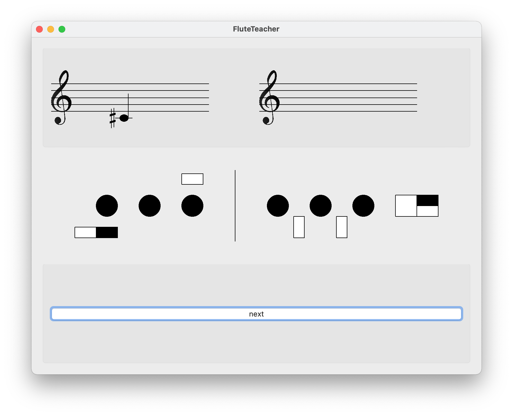

# FluteTeacher
I've made myself a Artificial Flute Teacher!
Here is a screenshot of the actual version:

## Features:
### Sure:
- [x] main window with 3 rows
- [x] `next` (note) button
- [x] upper-left staff draw
- [x] upper-left note respondive draw
- [x] note correspondance between text / drawn / A4-indexed
- [x] add sharp and flat symbols
- [x] corresp note number -> correct true note
- [x] upper right basic draw
- [x] flute draw
- [x] note recognition based on FFT &rarr;
- [ ] HearAI: continuous listening
- [ ] on HearAI: no note if SNR < threshold
- [ ] recognized note display
- [ ] automatic note validation

### For compilation:
- [ ] check requirements
- [ ] compile on MacOS
- [ ] compile on Windows 10

### Maybe:
- [ ] adding register information + draw ?
- [ ] encapsulate in a specific window
- [ ] add tuning setting
- [ ] add visual tuner
- [ ] better drawings?