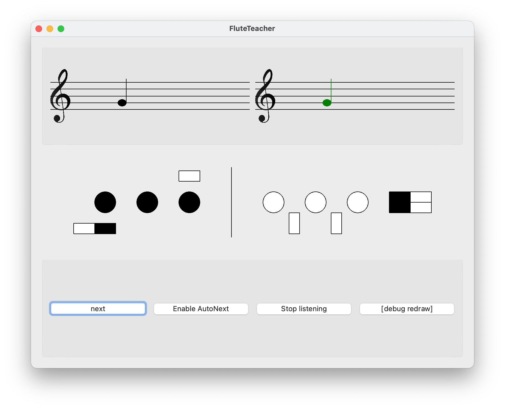

# FluteTeacher
Since I'm cheap and nerdy, I've made myself an Artificial Flute Teacher!

Here is a screenshot of the actual version:

## To-do list:
### Sure:
- [ ] MenuBar:
  - [x] add Arpeggiators
  - [ ] check current scale / octave / arp
- [ ] training mode selection:
  - [ ] Modes
  - [ ] Random + difficulty
- [ ] Arpeggiator:
  - [ ] THIRDS_UP_DOWN
  - [ ] Treat random as random choice over current scale
- [ ] Add note 1 / nnotes for arpeggiator?
- [ ] "About" window for copyright + website
- [ ] add "start at octave no 1/2" menu 
- [ ] add French translation
- [ ] finish notes -> ??
- [ ] add harmonic-minor scales
- [ ] add melodic-minor scales 
- [ ] Display mode:
  - [ ] single note
  - [ ] sheet music
- [ ] HearAI: continuous listening but take the last 200ms? in order to update more quickly and accurately
- [ ] Add Listening option :
  - [ ] play midi sound if available ? -> or pre-recorded sound ?
  - [ ] either single note
  - [ ] or the full scale
- [ ] Add proper close function
- [ ] Add 'bécarre'

### For compilation:
- [ ] check requirements
- [ ] compile on MacOS
- [ ] compile on Windows 10

### Maybe:
- [ ] adding register information + draw ?
- [ ] encapsulate in a specific window
- [ ] add tuning setting
- [ ] add visual tuner
- [ ] better drawings?
- [ ] for multiple notes: better auto placement (100px + proportion?)

## Version History:
### v0.4:
- Whole-tone scale + mode
- Splitting ScaleManager and Arpeggiator processes
- Arpeggiator:
  - For each: add 1 oct / 2 oct

### v0.3:
- True scale generator (with intervals)
- Adding minor scales
- Mode computing
- Empty menu bar
- Scales : Major / Minor

### v0.2:
- add "practice mode" selection
- change "normal mode" to "random notes"
- add "scale and modes practice" :

### v0.1:
- Main window creation with 3 rows
- `next` (note) button
- upper-left staff draw
- upper-left note respondive draw
- note correspondance between text / drawn / A4-indexed
- add sharp and flat symbols
- corresp note number -> correct true note
- upper right basic draw
- flute draw
- note recognition based on FFT &rarr;
- HearAI: continuous listening
- on HearAI: no note if SNR < threshold &rarr; set with volume only
- recognized note display
- automatic note validation
